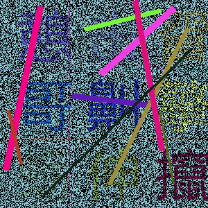

# 思路

## 抓包

* 点击第2页，发送了三个请求：'8?page=2'、'8_verify'、'data:image/jpeg;base64, ...'，其中第一个请求失败
* '8_verify'：返回的信息中含有base64编码的图片（包含在img标签中）、30*30个div
* 'data:image/jpeg;base64, ...'：省略号的内容就是上面请求中的base64编码(将该编码写入文件即可得到文件)，返回了一张图片验证码图片
* 验证通过后，会通过get请求，携带'answer'参数和page参数，就拿到了想要的数据
  * answer参数是由所点击的点的坐标构成的。

## 验证码

- 大小：300×300
  - 每个文字是规整的，大小为100×100（每个像素10，共10个）
  - 可以发现：
    - 第1个图片坐标值可以是（0～9）
    - 第2个图片坐标值可以是（10～19）
    - 第3个图片坐标值可以是（20～29）
    - 第4个图片坐标值可以是（300～309）
    - 第5个图片坐标值可以是（310～319）
    - 第6个图片坐标值可以是（320～329）
    - 第7个图片坐标值可以是（600～609）
    - 第8个图片坐标值可以是（610～619）
    - 第9个图片坐标值可以是（620～629）
- 干扰：背景颜色、线条干扰
  - 图像去噪

# 实践

## 手动识别图片

这个很简单，只需抓取图片后进行图片去噪加强即可，代码里面有。缺点是手动点很麻烦，如果页面数多的话这种方法显然不行。

## 深度学习识别图片

这个我相当于是个“半截子"，我参考别人的方法，写了个大概，用opencv去噪加强图片，用科大讯飞的ocr的api进行识别。但是识别准确率不高，主要是图片的去噪和加强做的不好。

所以这个题目相当于没做完，待处理的有：

* [ ] opencv进一步优化图片。
* [ ] 看看能不能自己训练一个模型出来。
