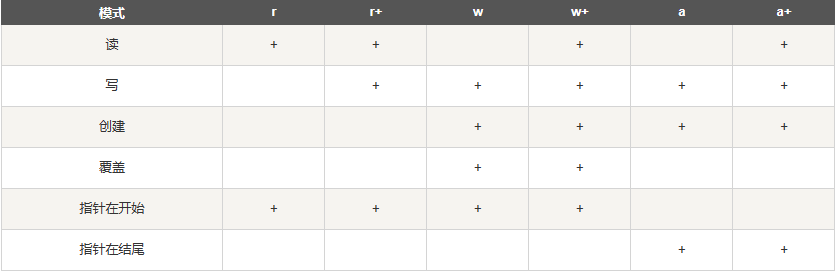

# 关于做题过程中不熟悉的函数进行的总结

## 基础语法

### 深浅拷贝

* python基于值管理，如a=2表明a指向值为2的内存空间，若a += 1，则a改变指向，也就是取出a的值加一放于新内存，a指向新内存
* 变量的赋值操作：只是形成两个变量，实际上还是指向同一个对象
  * a = b = 1：a是b的别名（可以理解为ab存放同一个地址），指向存放1的地址。若b += 1，则b指向存放2的地址，a不变
  * a = b = []：ab存放列表的地址，b若执行b.append(1)，a的值会跟着一起改，与b的值保持一致
* 深拷贝：使用copy模块的deepcopy函数，递归拷贝对象包含的子对象
* 浅拷贝：使用copy模块的copy函数，对象包含的子对象内容不拷贝
* 参考文章：[深浅拷贝](https://www.runoob.com/w3cnote/python-understanding-dict-copy-shallow-or-deep.html "click")

### Is和==

* is 判断两个变量引用对象是否为同一个
  * a is b：相当于 **id(a)==id(b)**
* **==** 用于判断引用变量的值是否相等

### 字符串编码

* UTF-8：可变长度编码，将字符串编码为二进制字节，支持所有unicode字符，可表示世界上所有语言，是国际化编码方式
  * 一个汉字3个字节
  * 128个ASCII编码1个字节
* GBK：固定长度编码，主要用于汉字字符编码，是国家标准，2个字节表示1个汉字字符

### print函数

1. 打印字符串：print('i am ')
   * 打印带引号的字符串用\转义：print('\\'i am \\'')

### 变量作用域

1. 同一级别模块变量不会回收问题：
   * ```python
     total = 0
     for i in range(5):
         total += i
     print(i)
     ```
   * 上述语句输出4，i不会被回收
2. 不同函数之间的变量会被回收

## 正则表达式

### 基础语法

1. 注意{m,n}中间不能有空格
2. 格式化字符串：f"{}"，花括号中为表达式
3. None是常量，不可用none

## 内置函数

### divmod

* divmod(a, b)：返回一个包含商和余数的元组(a // b, a % b)

### eval

* eval函数会将字符串表达式求值，如eval(input())，输入[1,2,3]返回列表

## 序列部分

### 列表

1. 创建空列表：注意list(d)，d是字典时，返回的是d的key值列表
2. 列表切片返回相反列表：l[::-1]
3. 返回最后一个元素：l[-1]
4. 若l中不存在a而使用l.index(a)，则会抛出valueerror错误
5. 列表原地排序：l.sort():
   * key = lambda x: (len(x), x)表示先按字符串x长度排序，长度相同的按字典顺序排序。会按照优先级排序，第一个优先级最高

### 集合

1. 创建空集合：set()，注意不是{}（字典可用{}）

## 模块部分

### math库

#### gcd

* from functools import gcd
  * gcd(a,b)表示求a和b的最大公约数

### Random模块

1. random.random(): 产生[0, 1)之间浮点数
2. random.randint(a, b): 产生[a, b]之间随机整数
3. random.uniform(a, b): 产生[a, b]之间随机浮点数
4. random.shuffle(x): 打乱序列x的顺序

### datetime库

* datetime库包含了四个类型：datetime、date、time、timedelta，分别表示日期+时间、日期、时间、时间差
* 对象可用months、days、seconds返回年、月、日

#### datetime类型

1. datetime.datetime(year, month, day[, hour[, minute[, second[, microsecond[,tzinfo]]]]])，返回年月日、时分秒（需print打印出来）
2. datetime.datetime().now()：返回当前系统时间
3. datetime.datetime. **strftime** ()：由日期格式转化为字符串格式
   * datetime.datetime.now().strftime('%b-%d-%Y %H:%M:%S')：'Feb-20-2023 17:53:06'
4. datetime.datetime. **strptime()** ：由字符串格式转化为日期格式
   * datetime.datetime.strptime('Feb-20-2023 17:53:06', '%b-%d-%Y %H:%M:%S')：datetime.datetime(2023, 2, 20, 17, 53, 6)

### collections库

* collections.__all__查看所有的子类，一共包含9个

#### Counter

* 计数器，是dict的子类，用于**计数可哈希对象**，它是一个集合，元素像字典键(key)一样存储，它们的计数存储为值
* Counter(list)：统计list中元素个数，返回字典

### itertools库

#### permutation

* from itertools import permutation:
  * permutation(l)：返回列表l的全排列

## 文件操作部分



1. open('文件名', mode)：mode可为r、w，b表示二进制文件
   * r和w都会将文件指针放在开头，即文件存在就删除所有内容，不存在就创建
   * +号可与rw结合，如与r+、w+表可读可写
   * a是追加模式，文件指针会放在文件末尾
2. 文件对象方法：
   * readline读一行，readlines读每一行返回列表
   * write(s)表示把s写入文件，**不会加换行**，writelines(l)把字符串列表l写入文件，也不加换行
3. 二进制文件读写：
   * 各模块序列化和反序列化不能跨越，如用struct序列化就不能用pickle反序列化
     * struct模块：
       * calcsize方法：计算格式字符串所占字节，如calcsize('i')返回4
       * pack方法：如pack('if?', num,1 float1, bool1)
       * unpack方法：如unpack('if?', buffer)
         * 返回一个元组，若只有一个条目，返回形式是-(item1,)
     * pickle模块:
       * dump方法：如dump(num1, fp)
       * load方法：如load(fp)
