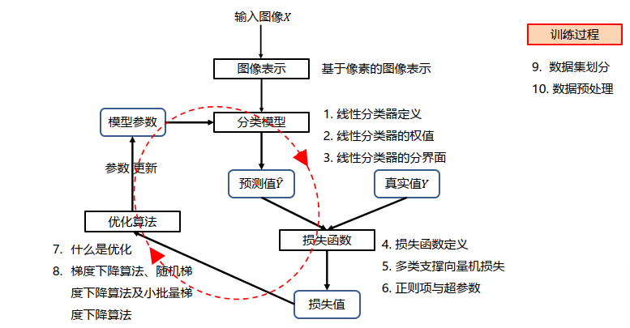
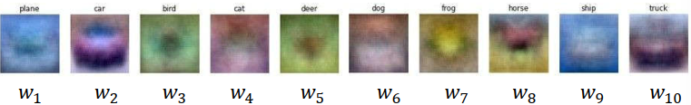
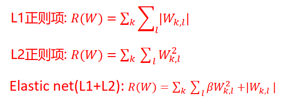
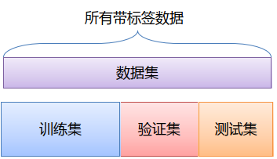
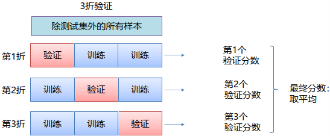
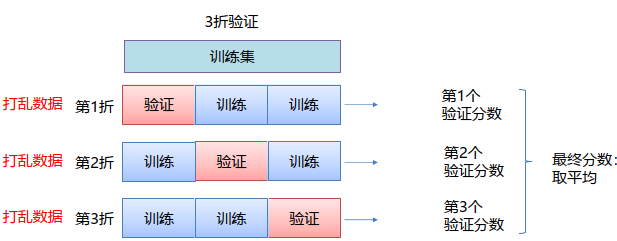
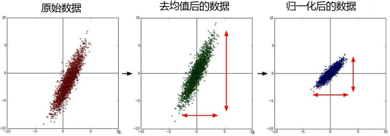

# 线性分类器设计

# 图像表示
- 大部分分类算法都要求**输入向量**
## 图像类型
1. 二进制图像：01组成，0是黑色、1是白色。
2. 灰度图像： 一般范围是0-256。
3. 彩色图像：rgb三个颜色通道。
# 分类模型
## 线性分类器定义
1. 线性分类器是一种线性映射，将输入的图像特征映射为类别**分数**。
    - $f_{i}(x, w_{i}) = w_{i}^{T}x + b_{i}$
        - i = 1, ..., c
        - x表示输入的d维图像向量，c为类别个数。
        - 每个类都有自己的参数w和b。
2. 线性分类器决策：若$f_{i}(x) > f_{j}(x)$，则决策输入图像属于第i类。
    - 决策步骤：
        - 图像表示成向量
        - 计算当前图片每个类别的分数
        - 按类别得分判定当前图像
## 线性分类器的权值

1. 权值看做是一种模板
2. 输入图像与评估模板的匹配程度越高，分类器输出的分数就越高
## 线性分类器的分界面

1. 分数等于0的线就是决策面：$w_{i}^{T}x + b_{i} = 0$
2. w控制着线的方向
3. b控制着线的偏移
4. 箭头方向代表分类器的正方向，沿着箭头方向距离决策面越远，分数就越高。
# 损失函数
## 损失函数定义
1. **损失函数**是一个函数，用于度量给定分类器的预测值与真实值的不一致程度，其输出通常是一个非负实值。
2. 其输出的非负实值可以作为反馈信号来对分类器参数进行调整，以降低当前示例对应的损失值，提升分类器的分类效果。
3. $L=\frac{1}{N} \sum_{i} L_{i}\left(f\left(x_{i}, W\right), y_{i}\right)$
## 多类支撑向量机损失
$$\begin{aligned}
L_{i} & =\sum_{j \neq y_{i}}\left\{\begin{array}{lr}
0 & \text { if } s_{y_{i}} \geq s_{i j}+1 \\
s_{i j}-s_{y_{i}}+1 & \text { otherwise }
\end{array}\right. \\
& =\sum_{j \neq y_{i}} \max \left(0, s_{i j}-s_{y_{i}}+1\right)
\end{aligned}$$
1. $s_{i j}=f_{j}\left(x_{\mathrm{i}}, w_{j}, b_{j}\right)=w_{j}^{T} x_{i}+b_{j}$
2. j是类别标签，取值1-c
3. sij：第i个样本第j类别的预测分数。
4. syi：第i个样本真实类别的预测分数。
- 正确类别的得分比不正确类别的得分高出1分，就没有损失。
- 否则，就会产生损失
## 正则项与超参数
1. 超参数：在开始学习过程之前设置值的参数，而不是学习得到。
2. L2正则项：

3. 常用正则项损失：

# 优化算法
## 什么是优化
1. **参数优化**是机器学习的核心步骤之一，它**利用损失函数**的输出值**作为反馈信号**来**调整分类器参数**，以提升分类器对训练样本的**预测性能**。
2. 优化算法的目标：损失函数是一个与参数w有关的函数，优化的目标就是找到使损失函数 达到最优的那组参数w。
## 梯度下降算法

1. 往哪儿走：负梯度方法。
2. 走多远：步长来决定。
3. while True
    权值的梯度 ← 计算梯度(损失, 训练样本, 权值)
    权值 ← 权值 – 学习率 * 权值的梯度
4. 梯度计算：
    - 数值法：近似, 慢, 易写
    - 解析法：精确, 快, 易错
    - 求梯度时一般使用解析梯度，而数值梯度主要用于解析梯度的正确性校验（梯度检查）。
5. 缺点：当样本很大时，权值的梯度计算量很大！
## 随机梯度下降算法
1. 定义：每次随机选择一个样本,计算损失并更新梯度。
2. 缺点：单个样本的训练可能会带来很多噪声，不是每次迭代都向着整体最优化方向。
## 小批量梯度下降算法
1. 定义：每次随机选择m（批量的大小，是个超参数）个样本,计算损失并更新梯度
2. 经验：通常使用2 的幂数作为批量大小，比如每次选取32或64或128个样本
3. 一些概念：
 - iteration：表示1次迭代，每次迭代更新1次网络结构的参数；
 - batch-size：1次迭代所使用的样本量；
 - epoch：1个epoch表示过了1遍训练集中的所有样本。
# 数据集划分

- 训练集：用于给定的超参数时分类器参数的学习；
- 验证集：用于选择超参数；
- 测试集：评估泛化能力；
1. K折交叉验证

2. 带有打乱数据的重复K折验证

# 数据预处理
1. 法一：

2. 法二：

# 附：线性分类器体验
[点我！](http://vision.stanford.edu/teaching/cs231n-demos/linear-classify/)